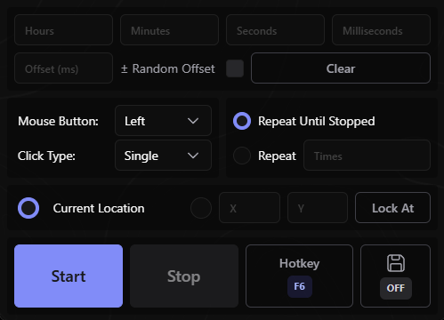

# Hyper Clicker

A modern lightweight auto-clicker built with Tauri

!WARNING! The hotkeys are in bad shape. I'll fix that very soon.

## Used

- [Tauri](https://github.com/tauri-apps/tauri)
- [Tailwindcss](https://github.com/tailwindlabs/tailwindcss)
- [Vue](https://github.com/vuejs/)
- [PrimeVue](https://github.com/primefaces/primevue)
- [Enigo](https://github.com/enigo-rs/enigo)
- [device_query](https://github.com/ostrosco/device_query)

## Screenshot

